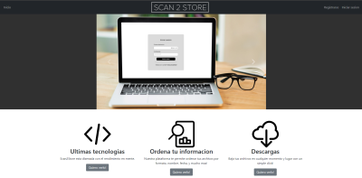
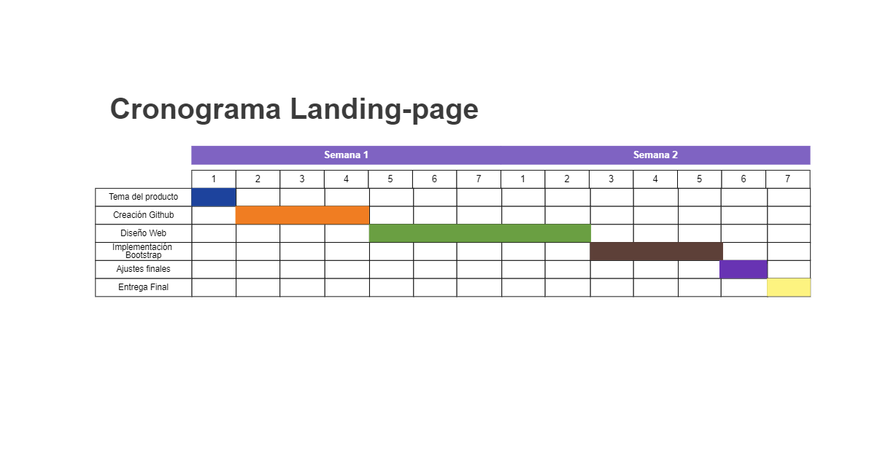

<!-- PROJECT LOGO -->
 <h3 align="center">Landing Page </h3>
<p align="center">
  <a href="https://github.com/pabpobar/Tarea1-Landing-Page/tree/LandingPage-Grupo9">
    
  </a>

 

  <p align="center">
   Metodología de Desarrollo de Software

<!-- TABLE OF CONTENTS -->
<details open="open">
  <summary>Tabla de Contenidos</summary>
  <ol>
    <li>
      <a href="#about-the-project">Acerca del Proyecto</a>
      <ul>
        <li><a href="#built-with">Construido con: </a></li>
      </ul>
    </li>
    <li>
      <a href="#getting-started">Empezando</a>
      <ul>
        <li><a href="#prerequisites">Prerrequisitos</a></li>
        <li><a href="#installation">Instalación</a></li>
      </ul>
    </li>
     </ol>
</details>


<!-- ABOUT THE PROJECT -->
## Acerca del Proyecto

<p align="center">
      
  </a>

Proyecto en cual se le permitirá a un usuario poder almacenar y administrar sus archivos digitales para poder mejorar su organización, además de poder digitalizar mediante el uso de fotos, documentos físicos. El usuario podrá, renombrar archivos al subirlos, borrar archivos y también descargar archivos que ya fueron subidos.

### Construido con:

* [Bootstrap](https://getbootstrap.com)
* [Laravel](https://laravel.com)

<br/>

## Cronograma del Proyecto

<p align="center">
      
  </a>


<!-- GETTING STARTED -->
## Empezando
A continuacion, se detallarán los prerrequisitos y los pasos de instalación para poder levantar el proyecto ```landing-page``` de una forma local, alias: localhost.

<br/>

### Prerrequisitos
1. Descargar e instalar NodeJS
2. Descargar e instalar Laravel
3. Descargar e instalar PHP V8
<br />

### Instalación

Clonar el repositorio desde ```https://github.com/TheCrist422/landing-page```

Instalar los paquetes de dependencias con ```npm install```

Abrir 2 consolas de comandos

En la primera consola escribir ```php artisan serve```

En la segunda consola escribir ```npm run watch```

Ingresar a la direccion designada (por lo general es: ```http://127.0.0.1:8000/```)

<br>

## Integrantes Scrum
* Cristián Troncoso (Scrum Master)
* Roberto Adasme (Product Owner)

### Equipo de desarrollo:
* Agustín Rivas
* Nicolás Jara
* Nicolás Balboltín


